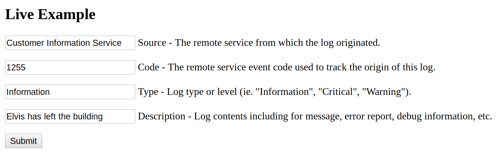
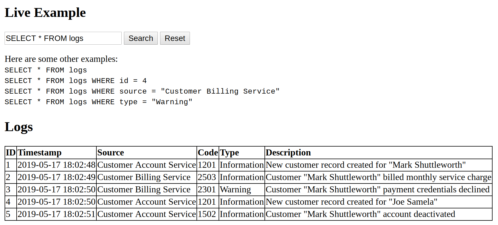

# Micro Service Log Tool

This API is an http server written in Python that can receive, store and retrieve log events. Events are described by this schema:

```
        {
            "source":"Customer Information Service",
            "code":1255,
            "type":"Information",
            "description":"example"
        }
```

>Where each value is defined as such:
>Source - The remote service from which the log originated
>Code - The remote service unique event code used to track the origin of this log (ex. Error code)
>Type - Log type used to indicate level of severity (ie. "Information", "Critical", "Warning")
>Description - Body of log message or report.

The API has two endpoints: 

`/submit` to submit new logs.

`/search` to search existing logs.

## Deployment
I deployed this application to my VPS (running Ubuntu Server 😉️) hosted by Google Compute Engine. It's running behind nginx (reverse-proxy). All the logs are stored and retrieved from an sqlite database.

## Documentation

### `/submit`

The API /submit method allows remote applications or microservices to submit logs via http POST request!

Submitted logs must contain a JSON object describing the log as body of the POST request. For example - to submit a log, send the following http POST request.

```
$ curl --header "Content-Type: application/json" --data '{"source":"Customer Information Service","code":1255,"type":"Information","description":"example"}' http://35.196.103.242/submit
```



### `/search`

The API /search method allows remote applications or microservices to search existing logs with an http POST request! Search queries contain a SQL query string as the body of the POST request.

For example - to search for every log, send the following POST request.

```
$ curl --data 'SELECT * FROM logs' http://35.196.103.242/search
```



## Future Improvement
If this project was more than proof of concept I would make the following improvements:

* Performance - I would fix this with a memcache to buffer incoming logs and write them to the database when ready.
* Authentication - anyone can see the contents of any submitted log
* Validation - you can submit logs that break application if they have invalid schema
* Security - ou can submit literally any query via /search. There's nothing stopping you from modifying the table, creating new tables, reading other table etc.
* Error handling - It would be nice to have easy to understand error message. Maybe it could log error messages to iself?

